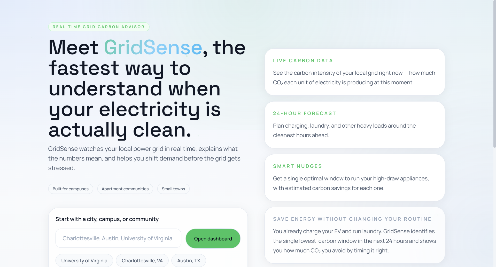
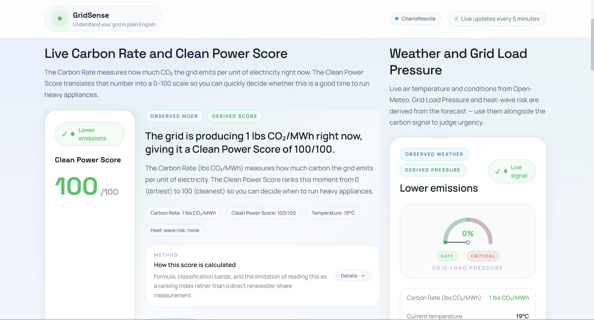
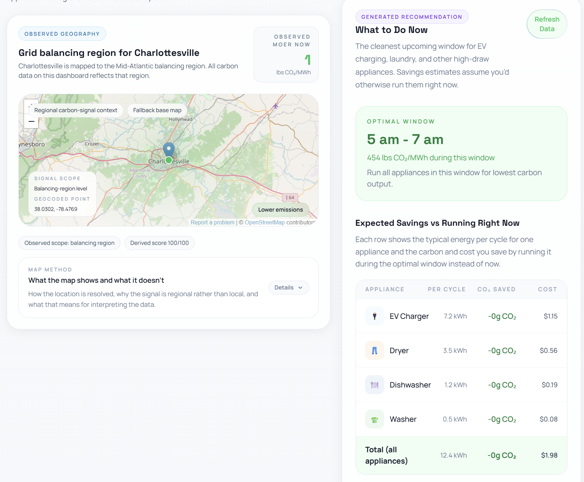

# GridSense

**Real-time grid carbon dashboard and demand spike simulator.**  
Built at HooHacks 2026.



---

## What it does

- **Live carbon intensity** — Shows the current Marginal Operating Emissions Rate (MOER) for any U.S. city, normalized into a 0–100 Clean Power Score
- **24-hour forecast** — Hourly MOER forecast chart with automatic best 2-hour window detection
- **Appliance nudges** — Tells you when to run your dishwasher, EV charger, washer, and dryer to minimize carbon emissions, with per-cycle CO₂ savings
- **Grid stress simulator** — Side-by-side heat wave / cold snap / normal day timelines showing how load-shifting prevents grid failure
- **Push alerts** — Subscribe to ntfy.sh notifications when Grid Load Pressure crosses 70%

## Screenshots





## Demo

[](https://www.youtube.com/watch?v=Tu1SLkQ7-Zg)

## Tech stack

| Layer | Tools |
|---|---|
| Backend | FastAPI, Uvicorn, Pydantic, httpx |
| Data | WattTime v3 (carbon), Open-Meteo (weather), Google Maps (geocoding) |
| AI | Azure OpenAI — nudge text generation only |
| Frontend | React 18, React Router, Vite, Tailwind CSS |
| Alerts | ntfy.sh |

## Quick start

### 1. Configure environment

```bash
cp .env.example .env
```

The default mode is `USE_MOCK_DATA=true`, which runs the full dashboard and simulator with no API keys.

For live data, set these in `.env`:

| Variable | Purpose |
|---|---|
| `USE_MOCK_DATA` | Set `false` to enable live data sources |
| `WATTTIME_USER` | WattTime account username |
| `WATTTIME_PASSWORD` | WattTime account password |
| `AZURE_OPENAI_BASE_URL` | Azure OpenAI endpoint (e.g. `https://your-resource.services.ai.azure.com/openai/v1/`) |
| `AZURE_OPENAI_API_KEY` | Azure OpenAI key |
| `AZURE_OPENAI_DEPLOYMENT` | Deployment name (e.g. `gpt-5.4-mini`) |
| `GOOGLE_MAPS_API_KEY` | For city geocoding |

### 2. Start the backend

```bash
cd backend
pip install -r requirements.txt
uvicorn main:app --reload --port 8000
```

### 3. Start the frontend

```bash
cd frontend
npm install
npm run dev
```

- Frontend: `http://localhost:5173`
- Backend: `http://localhost:8000`

## API reference

| Method | Endpoint | Description |
|---|---|---|
| `GET` | `/api/health` | Health check |
| `GET` | `/api/intensity?city=Charlottesville` | Current MOER, Clean Power Score, weather |
| `GET` | `/api/forecast?city=Charlottesville` | 24-hour hourly forecast |
| `GET` | `/api/weather?city=Charlottesville` | Temperature, conditions, heat-wave flag |
| `POST` | `/api/nudges` | Appliance timing recommendations with CO₂ savings |
| `POST` | `/api/simulate` | Grid stress simulation with load-shifting |

## Further reading

See [overview.md](overview.md) for a detailed explanation of every metric — MOER, Clean Power Score, Grid Load Pressure, the simulation model, and what's observed vs. derived vs. AI-generated.
